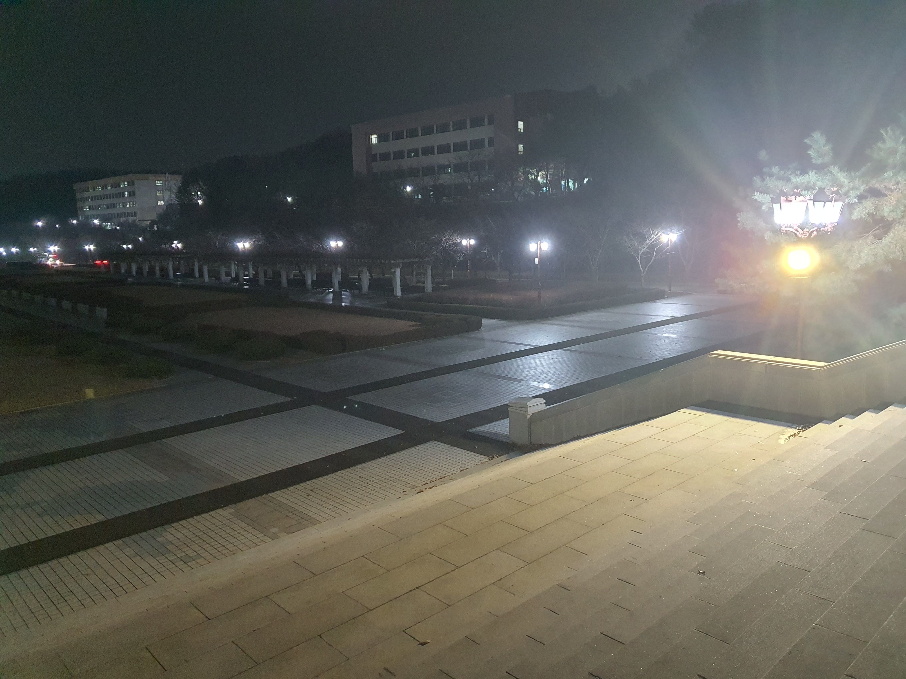
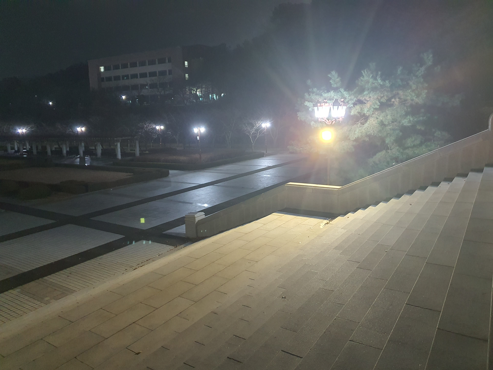
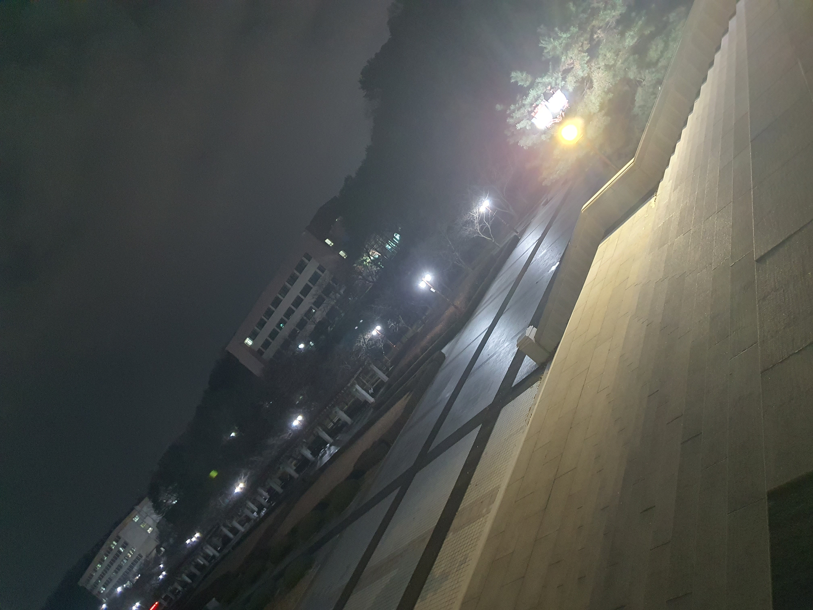
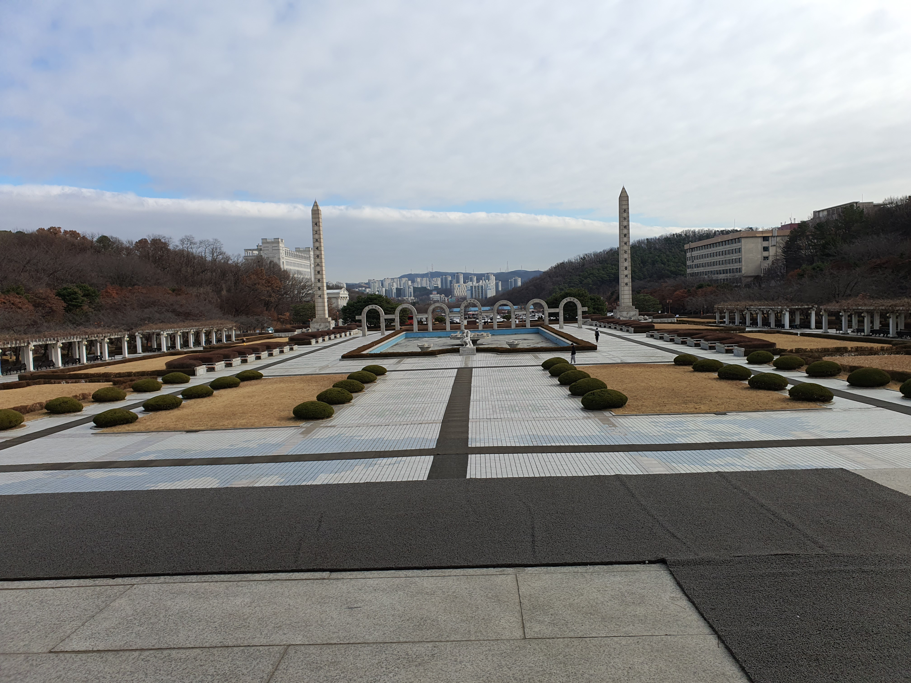

# What Is This Project?
&ensp; This repository is the bottom-up implementation of panorama images. Panorama image, known as image stitching technology, transforms multiple images into one image perspective. For example, the below image is made by the `imgs` directory. 

|1.jpg|2.jpg|3.jpg|4.jpg|5.jpg|6.jpg|7.jpg|8.jpg|9.jpg|10.jpg|
|---|---|---|---|---|---|---|---|---|---|
|||||||||||


- This is the final project of the computer vision lecture 2023 fall semester.  
- You can see the detailed procedure in `final_report.pdf` in Korean.

# Prerequisite
- opencv
- eigen 
- ubuntu22.04
```
sudo apt install build-essential libopencv-dev libeigen3-dev
```

# How to use? 

1. make a build directory
```shell
mkdir build
```

2. build the code 
```shell 
cd build 
cmake ..
cmake --build .
```

3. execute 
```shell
unlimt -s unlimited # this command is mendatory to prevent stack-overflow error
show_img.o
```

# Principle of Panorama
Homograpy transform, a.k.a. perspective transform, transforms a perspective from domain image to target image. Homography transform only works in two certain conditions. The first assumption is that the image's feature comes from a flat plane. The second assumption is that the movement of the image should be pure rotation. In other words, they should not be translated. 

# Flow chart


- It cover 
    - RANSAC (Random Sample Consensus)
    - Stitching algorithm
    - Tranform the image
    - ORB feature implementation (TBD)

- It doesn't cover (use opencv library)
    - image decode module
    - SIFT
